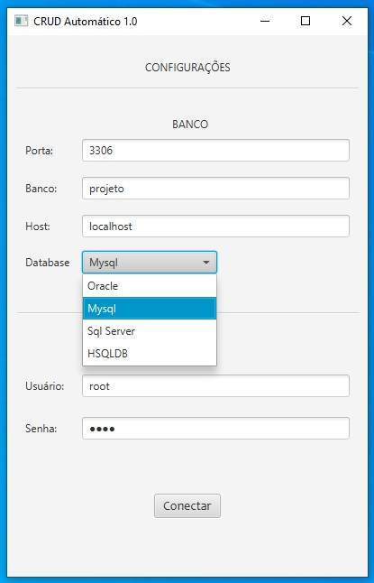

<br />


# Exemplos da interface implementada
<h3>Tela de configuração para acessar o banco</h3>


<h3>Arquivos gerados a partir da tabela Pessoa com os campos id e nome</h3>


Classe Bean (Model)
```java
/** Classe Bean gerada por Gerador Automático 1.0 */
package gerador.automatico.crud.model;

public class Pessoa{

	private int id;
	private String nome;

	public Pessoa() {
	}

	/**getters*/
	public int getId{
		return id;
	}
	public String getNome{
		return nome;
	}

	/**setters*/
	public void setId(int  Id){
		this.id = Id;
	}
	public void setNome(String  Nome){
		this.nome = Nome;
	}
}
```

Classe de Conexão
```java
/** Classe de conexão gerada por Crud Automático 1.0 */
package gerador.automatico.crud.connection;
import java.sql.Connection;
import java.sql.DriverManager;
import java.sql.SQLException;

/**
*	Esta classe implementa o Design Pattern Singleton
*/
public class ConnectionSingleton{

	private static Connection connection = null;
	ConnectionSingleton instance = new ConnectionSingleton();

	private ConnectionSingleton() throws SQLException{
		if(this.connection == null){
			try{
				   Class.forName("com.mysql.jdbc.Driver");
				   String SQL = "jdbc:mysql://localhost/teste";
				   this.connection = DriverManager.getConnection(SQL,"root","root");
			}catch(ClassNotFoundException e){
				throw new SQLException("Driver não encontrado!");
			}
		}
	}

	public Connection getConnection(){
		return this.connection;
	}

	public static void closeConnection(){
		try{
			this.connection.close();
		}catch(SQLException e){
			System.out.println("Erro ao fechar banco de dados!");
		}
	}
}
```

Classe DAO
```java
/** DAO gerado por CRUD Autom�tico 1.0 */
package gerador.automatico.crud.dao;
import java.sql.Connection;
import java.sql.PreparedStatement;
import java.sql.ResultSet;
import java.sql.SQLException;
import java.util.ArrayList;
import java.util.List;
import gerador.automatico.crud.interface.DAOInterface;
import gerador.automatico.crud.connection.ConnectionSingleton;
import gerador.automatico.crud.model.*;

public class PessoaDAO implements DAOInterface<Pessoa>{
    private Connection connection;

    public PessoaDAO() {
        this.connection = ConnectionSingleton().getInstance().getConnection();
    }

    @Override
    public void adicionar(Pessoa pessoa){

         String insert = "INSERT INTO pessoa(id, nome) values (?, ?)";
         PreparedStatement ps = null;
         try {
            ps = connection.prepareStatement(insert);
            ps.setint(1,pessoa.getId());
    	    ps.setString(2,pessoa.getNome());
            ps.executeUpdate();
            ps.close();
         } catch (SQLException e) {
            // TODO Auto-generated catch block
            e.printStackTrace();
            System.out.println("Erro ao inserir: " + pessoa);
         }
    }

    @Override
    public Pessoa findForId (int id) {

		String select = "SELECT  * FROM pessoa WHERE id = ?";
		PreparedStatement ps;
		Pessoa pessoa = new Pessoa();
		try {
			ps = connection.prepareStatement(select);
			ps.setInt(1, id);
			ResultSet rs = ps.executeQuery();
			if(rs.next()){
				pessoa.setId(rs.getInt("id"));
				pessoa.setNome(rs.getString("nome"));
			}
			rs.close();
			ps.close();
		} catch (SQLException e) {
			// TODO Auto-generated catch block
			e.printStackTrace();
			System.out.println("Erro ao buscar por id: " + pessoa);
		}
		return pessoa;
	}


    @Override
    public List<Pessoa> listar(){
		String select = "SELECT * FROM pessoa";
		PreparedStatement stmt;
		List<Pessoa> lista = new ArrayList<Pessoa>();
		try {
			stmt = this.connection.prepareStatement(select);
			ResultSet rs = stmt.executeQuery();
			while (rs.next()) {
				Pessoa pessoa = new Pessoa();
				pessoa.setId(rs.getInt("id"));
				pessoa.setNome(rs.getString("nome"));
				lista.add(pessoa);
			}
			rs.close();
			stmt.close();
		} catch (SQLException e) {
			// TODO Auto-generated catch block
			e.printStackTrace();
			System.out.println("Erro ao listar!");
		}
		return lista;
	}

    @Override
    public void atualizar (Pessoa pessoa){

		String update = "UPDATE pessoa SET id = ?, nome = ? WHERE id = ?";
		PreparedStatement ps;
		try {
			ps = this.connection.prepareStatement(update);
			ps.setint(1,pessoa.getId());
			ps.setString(2,pessoa.getNome());
			ps.executeUpdate();
			ps.close();
		} catch (SQLException e) {
			// TODO Auto-generated catch block
			e.printStackTrace();
			System.out.println("Erro ao atualizar: " + pessoa);
		}
	}

    @Override
    public void excluir(Pessoa pessoa){
        String delete = "DELETE FROM pessoa WHERE id = ?";
		PreparedStatement ps;
		try {
			ps = this.connection.prepareStatement(delete);
			ps.setInt(1, pessoa.getId());
			ps.executeUpdate();
			ps.close();
		} catch (SQLException e) {
			// TODO Auto-generated catch block
			e.printStackTrace();
			System.out.println("Erro ao excluir: " + pessoa);
		}
	}
}
```


Classe "View"
```java
/** Classe view gerada por Gerador Automático 1.0 */
package gerador.automatico.crud.view
import java.util.List;
import java.util.Scanner;
import gerador.automatico.crud.dao.*
import gerador.automatico.crud.bean.*

public class View {

	private PessoaDAO dao;

	public View() {
		// TODO Auto-generated constructor stub
		this.dao = new PessoaDAO();
	}

	/**
	 * Menu de navega��o principal
	 */
	public void navegacao(){
		int i;
		do{
			 menuPrincipal();
			 i = new Scanner(System.in).nextInt();
			 switch (i) {
			 case 1:
				adicionar();
				break;
			 case 2:
				editar(Pessoa pessoa);
				break;
			 case 3:
				excluir(Pessoa pessoa);
				break;
			 case 4:
				listar();
				break;
			 case 5:
				do{
					menuPesquisa();
					i = new Scanner(System.in).nextInt();
					switch (i) {
					case 1:
						buscarPorID(getIdPesquisa());
						break;
					case 2:
						buscarPorString(getStringPesquisa());
						break;
					}
				}while(i==1 || i==2);
				break;
			default:
				System.out.println("Saiu!");return;
			}
		} while(i > 1 || i < 5);
	}

	/**
	 * Menu de navega��o principal
	 */
	public void menuPrincipal(){
		System.out.println("\n********** CRUD ***********");
		System.out.println("1- Adicionar");
		System.out.println("2- Editar");
		System.out.println("3- Excluir");
		System.out.println("4- Listar");
		System.out.println("5- Pesquisar");
		System.out.println("6- Sair\n");
	}

	/**
	 * Menu para pesquisa
	 */
	public void menuPesquisa(){
		System.out.println("0- voltar");
		System.out.println("1- Pesquisar por id");
		System.out.println("2- Pesquisar por string\n");
	}

	/**
	 * M�todo para popular um objeto
	 * @return um Pessoa
	 */
	public Pessoa popularPessoa(){
		Pessoa pessoa = new Pessoa();
		System.out.println("Id:" )
		pessoa.setId(new Scanner(System.in).nextInt());
		System.out.println("Nome:" )
		pessoa.setNome(new Scanner(System.in).nextLine());
		return pessoa;
	}

	/**
	 * M�todo para adicionar
	 */
	public void adicionar(){
		getDao().adicionar(popularPessoa());
	}

	/**
	 * Perguntar ao usu�rio um ID
	 * @return um ID
	 */
	public int getIdPesquisa(){
		System.out.println("Informe o ID de pesquisa: ");
		int i = new Scanner(System.in).nextInt();
		return i;
	}

	/**
	 * Perguntar ao usu�rio uma string
	 * @return um nome
	 */
	public String getStringPesquisa(){
		System.out.println("Informe uma string para pesquisa: ");
		String i = new Scanner(System.in).nextLine();
		return i;
	}

	/**
	 * M�todo para editar
	 */
	public void editar(Pessoa pessoa){
		System.out.println("Editando  - " + pessoa);
		getDao().atualizar(pessoa);
	}

	/**
	 * M�todo para excluir
	 */
	public void excluir(Pessoa pessoa){
		System.out.println("Excluindo contato - " + pessoa);
		getDao().remover(pessoa);
	}

	/**
	 * Listar todos
	 */
	public void listar(){
		System.out.println("Listando...");
		List<Pessoa> l = getDao().listar();
		for (Pessoa pessoa : l) {
			System.out.println(pessoa.toString());
		}
	}

	/**
	 * Busca um por id
	 * @param id
	 */
	public void buscarPorID(int id){
		Pessoa c = getDao().findForId(id);
		if(c != null)
		    System.out.println(c.toString());
		else
		    System.out.println("Nenhum registro encontrado com o id: " + id);
	}

	/**
	 * Busca por string
	 * @param str
	 */
	public void buscarPorNome(String str){
		List<Pessoa> cs = getDao().findForString(str);
		if(!cs.isEmpty()){
		    for (Pessoa c : cs) {
			    System.out.println(c.toString());
		    }
		}else{
		       System.out.println("Nenhum registro encontrado com o parametro: " + str);
		}
	}

	/********************************************************/
 	/**GETTERS*/
	public PessoaDAO getDao() {
		return dao;
	}

   	/**SETTERS*/
	public void setDao(PessoaDAO dao) {
		this.dao = dao;
	}
}
```

